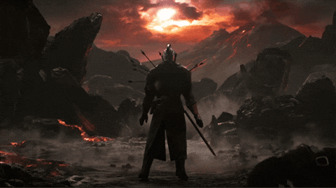

<h1 align="center">
  
</h1>

<div align="center">

# 👾 Hi, I'm Maulana Amir! 👾

🎯 Passionate developer with a love for clean code, creative digital design, and terminal wizardry.  
💻 Mostly hacking around with JavaScript, PHP, and recently diving into the world of AI.  
🌑 Proud dark theme enthusiast.  

[](https://github.com/maulanaamir)
[](https://gitlab.com/maulanaamir)

</div>


## 🚀 Tech Stack

```bash
💡 Languages     : JavaScript, PHP, Python, HTML, CSS
🛠️ Frameworks    : React, Tailwind CSS, Node.js, Express
💾 Databases     : MongoDB, MySQL
🧩 Tools & IDE   : VS Code, Git, Figma
📱 Other         : Firebase, Arduino, REST API
